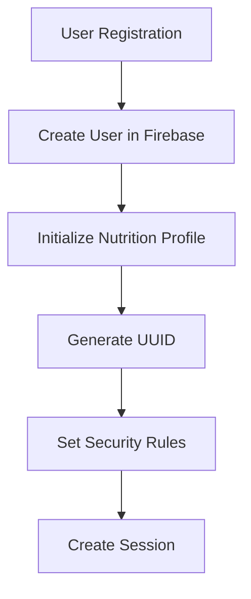
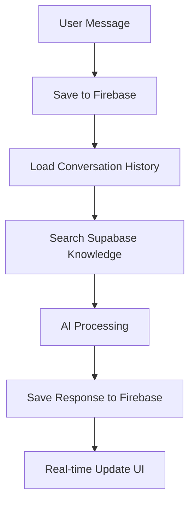
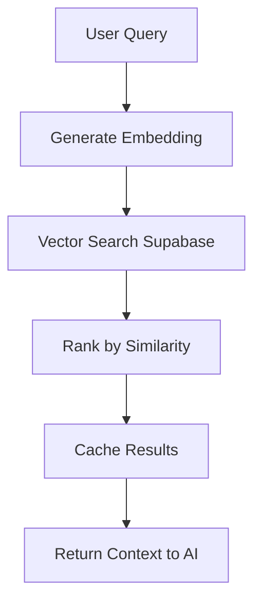

# TroponinIQ Database Architecture

## Overview

TroponinIQ uses a **dual-database architecture** optimized for both user experience and AI performance. This hybrid approach combines the strengths of different database systems for specific use cases.

## Database Systems

### 1. Firebase Firestore (Primary Database)

**Purpose**: Primary application data storage and real-time features

**Data Stored**:
- User accounts and authentication
- User nutrition profiles (embedded documents)
- Chat conversations and message history
- System messages and notifications
- User preferences and settings
- Session management data

**Why Firebase**:
- ✅ Real-time synchronization for chat features
- ✅ Excellent mobile/web SDK integration
- ✅ Built-in authentication integration
- ✅ Offline support for PWA functionality
- ✅ Automatic scaling and maintenance
- ✅ Security rules for data protection

**Collection Structure**:
```typescript
// Users Collection
{
  id: string,                    // UUID
  email: string,                 // Normalized email
  name: string,                  // Display name
  displayImage?: string,         // Profile image URL
  password?: string,             // Hashed (email auth only)
  created_at: Timestamp,
  last_active: Timestamp,
  nutritionProfile: {            // Embedded document
    preferred_name?: string,
    height_feet?: number,
    height_inches?: number,
    weight_lbs?: number,
    body_fat_percentage?: number,
    age?: number,
    gender?: 'male' | 'female' | 'other',
    // ... additional profile fields
  }
}

// Chats Collection
{
  id: string,                    // UUID
  userId: string,                // Foreign key to Users
  title: string,                 // Chat title
  visibility: 'public' | 'private',
  createdAt: Timestamp,
  updatedAt: Timestamp
}

// Messages Collection  
{
  id: string,                    // UUID
  chatId: string,                // Foreign key to Chats
  role: 'user' | 'assistant',
  content: string,               // Message content
  createdAt: Timestamp
}
```

### 2. PostgreSQL/Supabase (AI Knowledge Database)

**Purpose**: Vector search and AI knowledge retrieval

**Data Stored**:
- Justin Harris's 20+ years of FAQ knowledge
- Vector embeddings for semantic search
- AI retrieval context and knowledge base
- Cached search results for performance

**Why PostgreSQL/Supabase**:
- ✅ Advanced vector search capabilities (pgvector)
- ✅ Complex SQL queries for knowledge retrieval
- ✅ High-performance similarity search
- ✅ Specialized for AI/ML workloads
- ✅ Cost-effective for large knowledge bases
- ✅ Redis-like caching for hot data

**Schema Structure**:
```sql
-- jtt_v2 table (FAQ Knowledge Base)
CREATE TABLE jtt_v2 (
  id SERIAL PRIMARY KEY,
  upsert_key TEXT UNIQUE,
  content TEXT,
  data_type TEXT,
  source_doc_name TEXT,
  custom_metadata JSONB,
  embedding VECTOR(1536),  -- OpenAI embedding dimensions
  created_at TIMESTAMP DEFAULT NOW()
);

-- Vector similarity search function
CREATE OR REPLACE FUNCTION match_documents(
  query_embedding VECTOR(1536),
  match_count INT DEFAULT 5,
  filter JSONB DEFAULT '{}'
) RETURNS TABLE (
  upsert_key TEXT,
  content TEXT,
  similarity FLOAT
);
```

## Data Flow Architecture

### User Registration Flow


### Chat Conversation Flow


### AI Knowledge Retrieval Flow


## Performance Optimizations

### Caching Strategy
- **Redis Cache** (Production): Fast access to frequently searched knowledge
- **Memory Cache** (Development): In-memory storage for quick iteration
- **Firestore Cache**: Client-side caching for offline support
- **CDN Cache**: Static assets and images

### Cache Layers:
1. **Embedding Cache**: 5-minute TTL for query embeddings
2. **Results Cache**: 2-minute TTL for search results  
3. **Query Expansion Cache**: 10-minute TTL for expanded queries
4. **User Session Cache**: Session-length TTL for user data

### Database Indexing:
```sql
-- Supabase Performance Indexes
CREATE INDEX ON jtt_v2 USING ivfflat (embedding vector_cosine_ops);
CREATE INDEX ON jtt_v2 (data_type);
CREATE INDEX ON jtt_v2 USING gin (custom_metadata);
```

```typescript
// Firebase Composite Indexes
// Firestore automatically creates single-field indexes
// Composite indexes defined in firestore.indexes.json:
{
  "indexes": [
    {
      "collectionGroup": "messages",
      "queryScope": "COLLECTION",
      "fields": [
        {"fieldPath": "chatId", "order": "ASCENDING"},
        {"fieldPath": "createdAt", "order": "ASCENDING"}
      ]
    }
  ]
}
```

## Security Architecture

### Firebase Security Rules
```javascript
// User data protection
match /Users/{userId} {
  allow read, write: if request.auth != null 
    && request.auth.uid == userId;
}

// Chat data protection  
match /Chats/{chatId} {
  allow read, write: if request.auth != null
    && resource.data.userId == request.auth.uid;
}
```

### Supabase Row Level Security
```sql
-- Knowledge base is read-only for all authenticated users
CREATE POLICY "Allow read access" ON jtt_v2
  FOR SELECT USING (true);

-- Only admin can modify knowledge base
CREATE POLICY "Admin only writes" ON jtt_v2
  FOR ALL USING (auth.jwt() ->> 'role' = 'admin');
```

## Backup and Recovery

### Firebase Backups
- **Automated Daily Backups**: Firebase automatically backs up Firestore
- **Export Schedule**: Weekly exports to Google Cloud Storage
- **Point-in-Time Recovery**: 7-day retention for operational recovery

### Supabase Backups
- **Automated Daily Backups**: Full PostgreSQL dumps
- **Knowledge Base Snapshots**: Version-controlled knowledge exports
- **Disaster Recovery**: Geographic replication for high availability

## Monitoring and Alerting

### Key Metrics
- **Firebase**: Read/write operations, storage usage, security rule violations
- **Supabase**: Query performance, vector search latency, connection pooling
- **Cache**: Hit rates, TTL efficiency, memory usage
- **AI**: Knowledge retrieval accuracy, response quality

### Alert Thresholds
- Database connection failures > 1%
- Query response time > 2 seconds
- Cache hit rate < 80%
- Failed vector searches > 5%

## Cost Optimization

### Firebase Costs
- **Read Operations**: Optimized with client-side caching
- **Write Operations**: Batched operations where possible
- **Storage**: Efficient document structure with embedded profiles
- **Bandwidth**: Minimized with selective field queries

### Supabase Costs
- **Compute**: Right-sized for AI workload patterns
- **Storage**: Compressed embeddings and efficient indexing
- **Bandwidth**: Cached results reduce repeated queries
- **Vector Operations**: Optimized similarity search queries

## Migration Strategy

### Future Considerations
- **Single Database Migration**: Potential consolidation if Firestore adds vector search
- **Edge Database**: Possible edge deployment for global latency reduction
- **Sharding Strategy**: Horizontal scaling plan for high-volume growth
- **Multi-Region**: Geographic distribution for international expansion

## Development Guidelines

### When to Use Firebase
- User account data and authentication
- Real-time chat features and messaging
- User preferences and application state
- Any data requiring offline synchronization

### When to Use Supabase
- AI knowledge retrieval and vector search
- Complex analytical queries
- Background processing and batch operations
- Data requiring advanced PostgreSQL features

### Transaction Patterns
- **Firebase Transactions**: User account operations, critical state changes
- **Supabase Transactions**: Batch knowledge updates, complex queries
- **Cross-Database Consistency**: Application-level consistency where needed

---

This architecture provides TroponinIQ with the flexibility to scale both user-facing features and AI capabilities independently while maintaining optimal performance for each use case.
